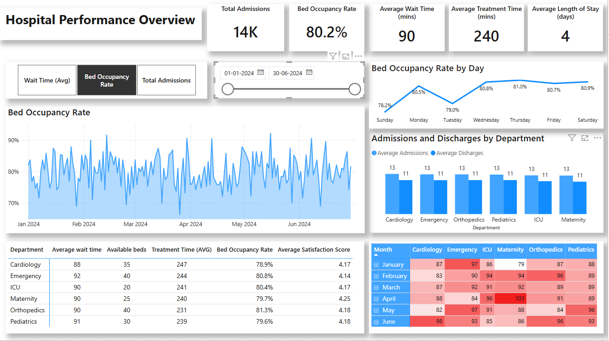

# Hospital-Performance-Dashboard - Power BI
## Objective
This dashboard was built to help hospital administrators identify **ways to reduce average patient wait time** and improve operational efficiency across departments using a 6-month dataset.

## Dataset Summary
The dataset contains:
- Daily records from January to June 2024.
- Columns used : Date, Department, Total Beds, Occupied Beds, Admissions, Discharges, Wait Time, Treatment Time, Length of Stay.

## Key Insights
- **Bed Occupancy Rate Trend** : Shows variation over time and by weekday.
- **Department Performance** : Breakdown of wait time, treatment time, bed usage.
- **Admissions vs Discharges** : Daily averages by department.
- **Heatmap** : Trends in average wait time across departments and months.
- **KPIs** : Real-time view of total admissions, bed occupancy, average wait & treatment time.

## Tools Used
- Power BI
- DAX
- Custom Visuals & Formatting

## Dashboard Preview

## Files Included

